<p align="center">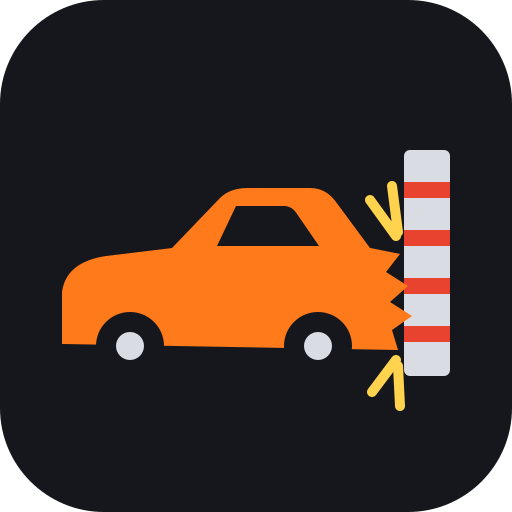</p>

<h1 align="center">Crush Stream</h1>

<p align="center"><b>Play: <a href="https://baconwhiskey.org/crush/">https://baconwhiskey.org/crush/</a></b></p>

Crush Stream is a car-crash sandbox that runs in the browser. Every car is a soft body: named control particles are shape-matched (Müller et al. 2005) inside crush cages, so a head-on folds the bonnet, a T-bone dents the door, and a press flattens the roof. You can watch a fleet of up to 32 cars pile up in slow motion, drive one yourself in a demolition derby or a circuit race, crush a parked car with a press, eight pistons or a door ram, or bring friends into a room over WebRTC. It's built with three.js, plain TypeScript classes and a small React HUD, and needs no install beyond a WebGL2 browser.

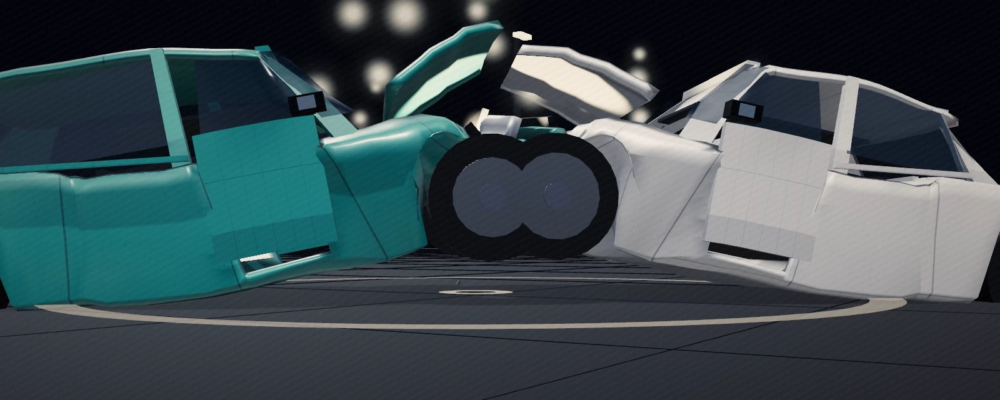

## Features

### Soft-body crush
Each car carries a rig of named masses (`rig-spec.ts`) grouped into shape-match clusters, eight-corner crush cages per body part, and contact sensors. Plastic travel is kept per region, so damage builds up over hits. Doors hinge, latch and tear off, mirrors break away, glass shatters, and wheels come loose. The lattice solver is still there as a toggle (Y). Debug views show the control particles (P: size = mass, colour = plastic travel or contact) and the rig (G: cages, sensors, hulls).

| Control particles (P) | Deformation rig (G) |
|---|---|
| 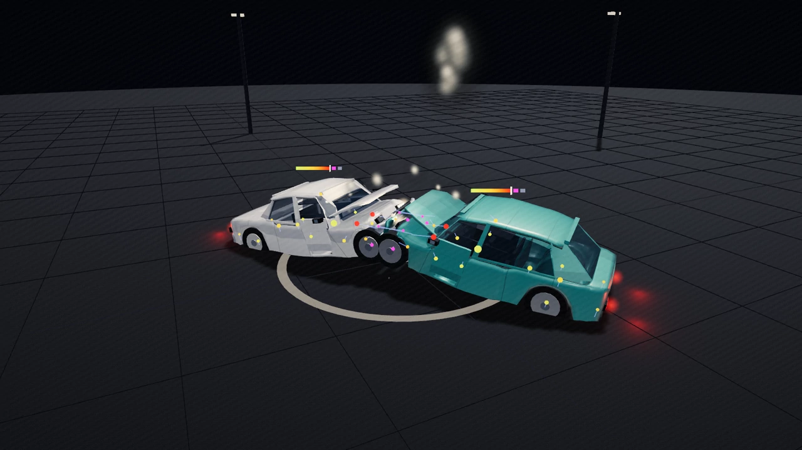 | 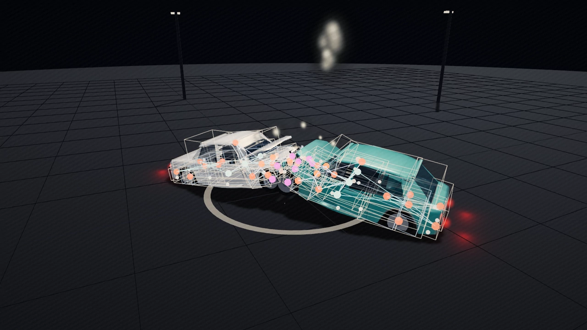 |

### Scenes
One scene at a time, from the bottom bar or a key. A pick pulses the view into a cel-shaded look, fades through black while the new scene warms up, then fades in (a plain fade with FX off or minimal, or reduced motion):

- **Fleet** (R): 1–32 cars on collision courses, with an optional jersey barrier (B), ramp balls (K) and jump ramps (.).
- **Derby** (D): a walled bowl where AI cars hunt each other until one is left running. Take the wheel of any of them.
- **Race** (Z): circuit racing against AI; see [Race mode](#race-mode) below.
- **Survival** (bottom bar): Driver 2's mode on Havana's Plaza de la Revolución. One car, a pack of cops that grows and hunts you over the grass, up the embankment and round the buildings; the stopwatch is the score. Held slow beside a cop for 12 s and you are busted; a wreck ends it too. Best time is kept. Single player. See [`docs/SURVIVAL.md`](docs/SURVIVAL.md).
- **Press** (C): two plates close on a parked car.
- **Pistons** (I): eight rams around a parked car; fire one (1–8) or all (0). See [`docs/PISTON_RIG.md`](docs/PISTON_RIG.md).
- **Doors** (N): one ram runs down a parked car's side, grazing the mirror, driving an open door past its stop or slamming it shut. D and E do the same to a stretched quarter panel. See [`docs/DOOR_RIG.md`](docs/DOOR_RIG.md).
- **Corkscrew** (,): a car launched up a twisted channel; the spawn-speed slider decides the stunt (no air, a roof landing, or one or two rolls back onto the wheels).
- **Stack** (/): cars dropped one at a time onto a base car, so the bottom roof crushes by the weight above it ([`docs/LOAD_CRUSH.md`](docs/LOAD_CRUSH.md)). Sliders: cars in the stack (2–20), drop height over the stack, seconds between drops; defaults 4 / 0.02 m / 8 s, the values of `vehicle/stack-crush.test.ts`. The panel reads each car's load (kN of the cars on it) and roof crush (mm) off the sim.
- **Range** (bottom bar): the ejection range. A car hits a jersey barrier at 100 km/h and the driver is thrown over it into a sand field with distance signs.

| Derby | Press |
|---|---|
| 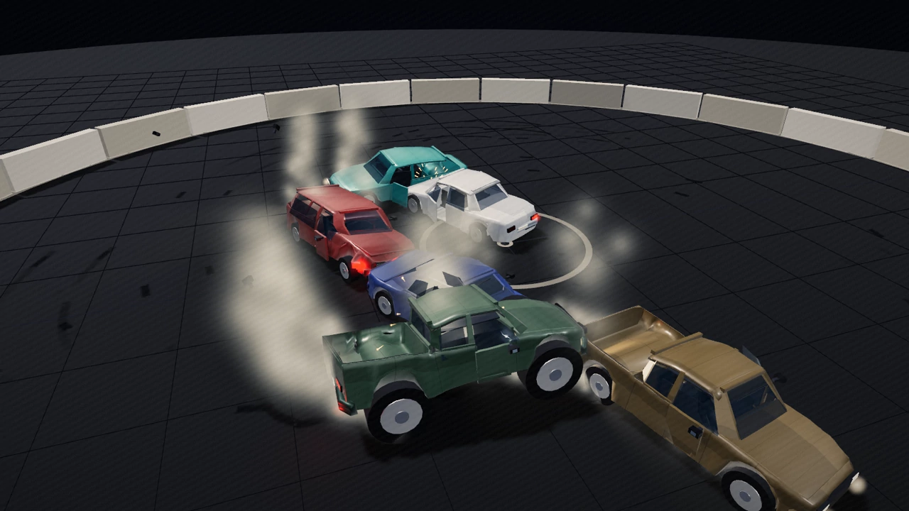 | 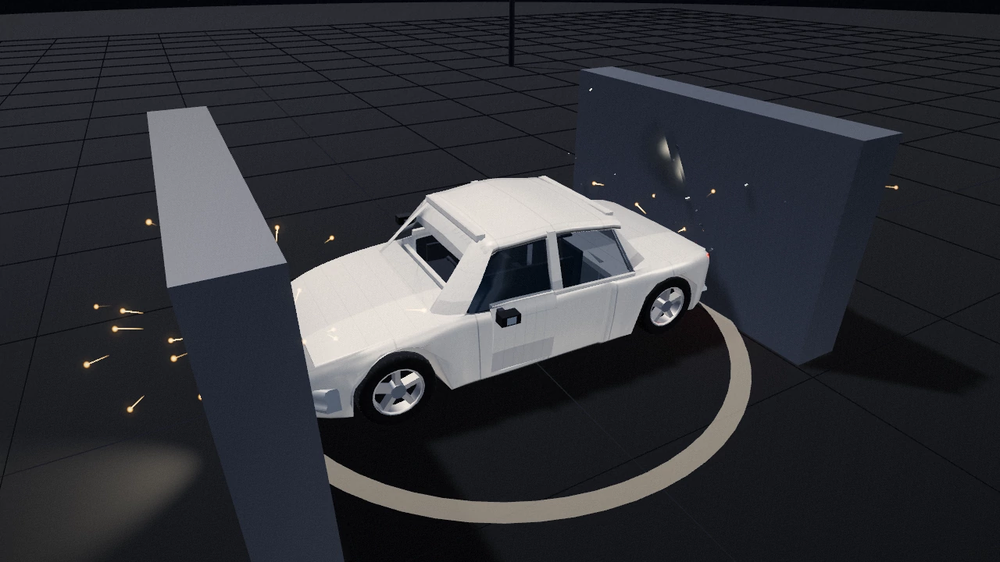 |
| **Pistons** | **Doors** |
| 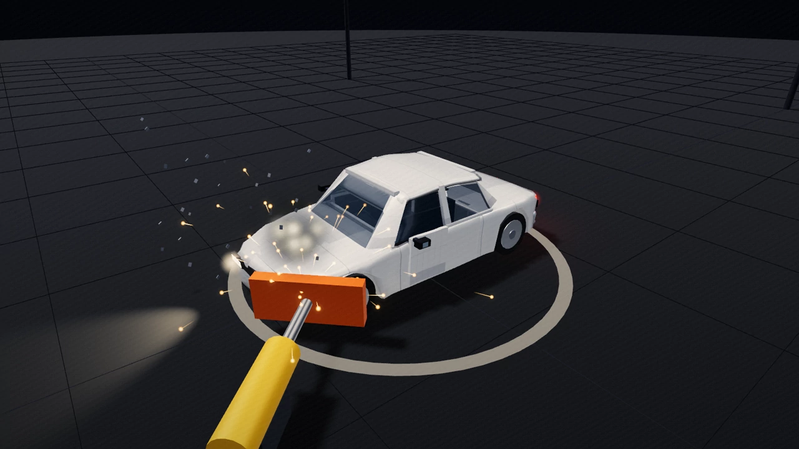 | 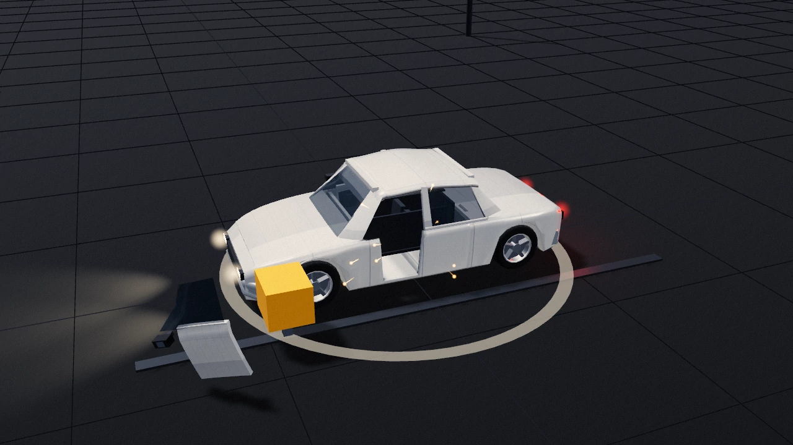 |

### Vehicle classes and handling
Four classes, **Sedan**, **Muscle**, **Truck** and **Monster**, each with its own mass, grip, power and damage tolerance. One **Realism** slider runs from arcade (assists, forgiving grip, cars survive more) to realistic. Damage changes how a car drives: a limping engine loses power, and a dead one stops. Boost (Shift) recharges, and a derby takedown fills it. Details are in [`docs/HANDLING.md`](docs/HANDLING.md).

### Cinematic FX
Four tiers, **off / minimal / low / high**, plus **Auto**, the default (F key, HUD, or `?fx=off|minimal|low|high` in the URL; a manual pick turns Auto off). Auto lifts a desktop with a hardware GPU that holds 60 fps to `high` after boot, steps down a tier whenever it holds under 50 fps for 2 s, and starts every race or derby on `minimal`, then lifts it to the tier the machine holds 3 s after the green light. The `low` and `high` tiers add an HDR post chain with bloom, an ACES grade and film grain, an impact punch with a short hit-stop, a crash cam that cuts to three angles during the slow-mo, tyre marks on the GPU, tyre smoke, and spark streaks. Night (H) lights the lot with lamp-pole pools and the cars' own lamps, and Wet (X) makes the asphalt glossy. See [`docs/CINEMATIC.md`](docs/CINEMATIC.md).

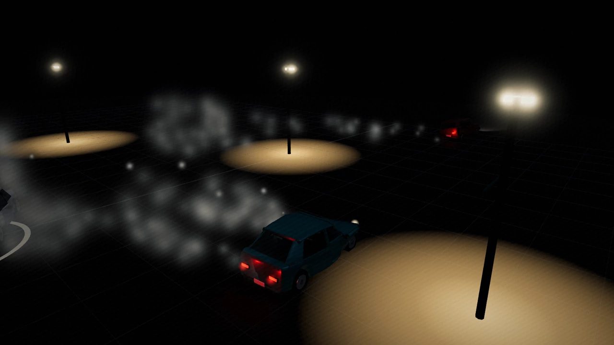

<details><summary>Slow-mo crash cam (animated, 270 kB)</summary>

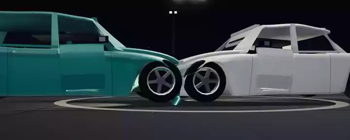

</details>

### Multiplayer
Press **Net** (top centre) to host or join a room by code, or hit **Public race** / **Public derby** to join the best open public room of that kind and build (a lobby or results screen before a running match, then the most distinct players), or open one if there is none. In race mode, a one-tap **Play online** does the same (a weak device searches about 12 s before it hosts), and a live-races pill lists the open rooms with Join. A private room gives you a **Copy invite link** button and a QR code for phones. Rooms hold up to 8 players. One machine (the host) simulates and everyone else draws its snapshots, so the crushed meshes and contact points match on every screen. Peers talk over WebRTC data channels, and the server (`/api/rtc`) only relays the handshake. A "This browser (tabs)" link is there for local testing. See [`docs/MULTIPLAYER.md`](docs/MULTIPLAYER.md).

### Race mode
Four courses, Brickyard Oval, Ridge Rally, Harbour Streets and Crossover Canyon (a stunt course), for 2–16 racers over 1–5 laps (3 by default), with NPC traffic on the city course and an optional police chase (packs of police cars park beside the course and hunt the racers). Hidden checkpoint gates count the laps, and every course has at least one designed shortcut. You can respawn, or play no-reset where a wrecked car is out. AI racers have an aggression dial, and a campaign runs over every course with points and standings. The arcade HUD has a focus view (H toggles the full menu), and the menus work with a controller. Pick **Race** in the bottom bar or press Z. See [`docs/RACE_DESIGN.md`](docs/RACE_DESIGN.md).

| Crossover Canyon, with the race HUD | Harbour Streets, at the start |
|---|---|
| 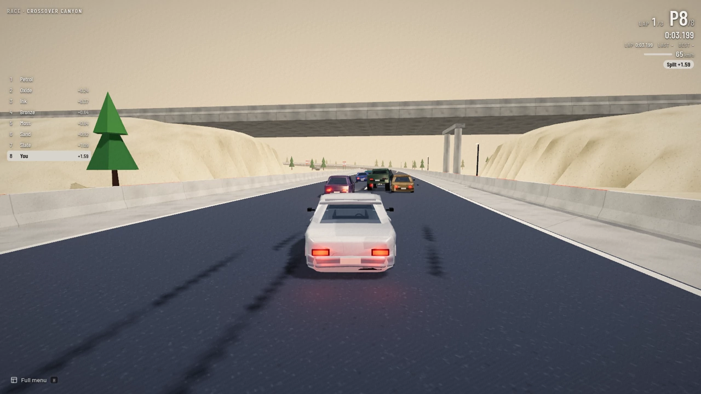 | 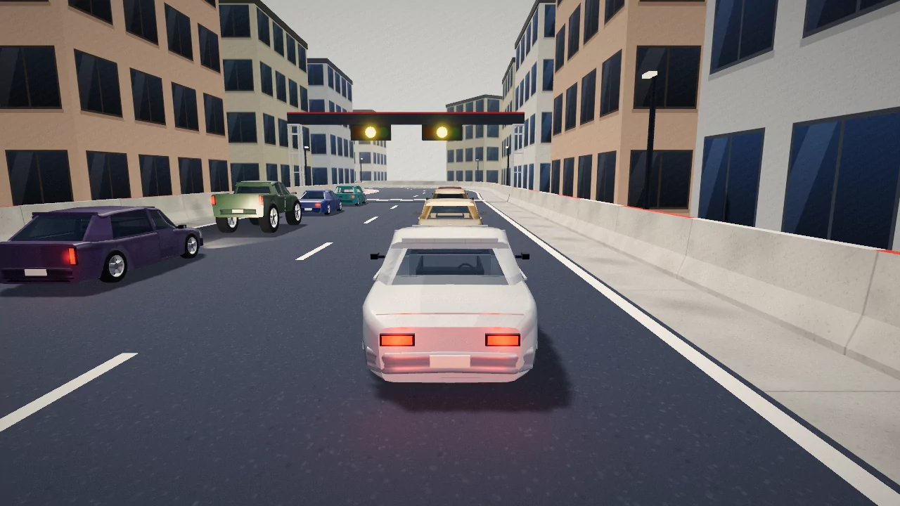 |

### Crash highlights
When a race ends, its five biggest crashes replay in slow motion behind the results: a far-overhead flight between clips, then trackside, wheel-well and chase shots and the crash cam over each hit. Every netplay peer sees the same shots at the same moment. **Watch** shows one clip alone with no HUD (tap or Esc to leave), and **Save** keeps it in this browser to replay later from the race setup menu. See [`docs/HIGHLIGHTS.md`](docs/HIGHLIGHTS.md).

## Controls

Every action with its key, controller button and touch control is in [`docs/CONTROLS.md`](docs/CONTROLS.md). On phones and tablets a thumb pad (stick lower left, captioned buttons lower right) drives through the controller path, and the bottom bar has a **Fullscreen** button. The HUD mutes itself after 5 s without a tap and wakes on any tap.

| Scene | |
|---|---|
| Space | pause / play (handbrake while driving) |
| R | reset / reshuffle (recover the car while driving) |
| L | loop the crash |
| B | jersey barrier |
| C | compactor (camera view while driving) |
| I | piston rig: eight rams around a parked car (docs/PISTON_RIG.md); speed, mass, face hardness and hold-car in its panel |
| 1–8 / 0 | piston rig: fire one ram (clockwise from front-left) / all eight |
| N | doors scene: one ram down a parked car's side (docs/DOOR_RIG.md); speed, mass, side and door open/shut in its panel |
| 1–3 / 4 / 5 | doors scene: fire A (mirror graze, shut door) / B (open door from behind, past the stop) / C (open door from the front, toward shut); 4 opens or shuts the door; 5 swaps side |
| D | demolition derby (from the whole-field view) |
| K | ramp balls |
| . (period) | jump ramps (fleet only) |
| , (comma) | corkscrew scene |
| / (slash) | stack scene |
| G | deform rig |
| P | control particles: size = mass, lime → red = plastic travel, magenta = contact, yellow line = shape-match pull (short pulls drawn up to 4×), blue line = rest → now; the bar above each car marks its worst travel |
| Y | shape ↔ lattice |
| M | auto slow-mo |
| O | auto-orbit camera |
| U | audio |
| F | cinematic FX tier: off → minimal → low → high (turns Auto off) |
| H | night |
| X | wet asphalt |
| J | JSON trace capture (off by default) |
| JSON button | copy this run's spawn (counter = 1; no extra ticks unless capture is on) |
| drag / scroll | orbit camera |
| Z | race mode (setup menu) |

Hotkeys leave Ctrl / Cmd / Alt chords to the browser (Ctrl+R reloads, Ctrl+C copies) and skip keys typed into a text field, select or editable area.

| Racing (no menu open) | |
|---|---|
| Esc / Start / Back | pause menu |
| R / D-pad ↓ | respawn |
| Q / E, LB / RB | previous / next car while spectating |
| V / C / T, Y / Triangle, the Spectating bar's camera button | camera view. Driving: chase → far chase → hood cam. Spectating: those three, then **Trackside** (a fixed eye ahead of the car beside the track, clear of walls and props, tracking it past, then the next spot), **Wheel cam** (a dutch-angle mount on a wheel well, looking forward or back, cutting every few seconds to the well that shows the most rivals), **Orbit** and **Auto** (the highlight reel's shot director run live on the followed car) |
| drag (one finger on a phone) | while spectating: look round the car in the chase views and keep that angle (the eye stays where you put it; nothing to steer); orbit in Orbit |
| H | focus view ↔ full menu (the sandbox hotkeys only work in the full menu; B and K stay off while racing) |
| ` (Backquote) / R3 | look back from the driven or spectated car while held |

| Driving: keyboard + mouse | |
|---|---|
| click a car, Q / E | follow it, previous / next car |
| W / ↑ | gas (brakes first while rolling backward) |
| S / ↓ | brake; once stopped, reverse |
| A / ←, D / → | steer left / right, relative to the car. Reversing steers like a real car: A backs the tail to the left. No turning on the spot |
| Space | handbrake (sharper turn, slows the car) |
| Shift | boost (drains while used under gas, recharges, fills on a derby takedown) |
| drag | look round the car; eases back behind it 0.8 s after release |
| V / C / T | camera: chase → far chase → hood cam |
| ` (Backquote) | look back while held; release returns at once |
| R | recover: back on its wheels where it stands, at rest and repaired (derby: only when flipped and still running) |
| Esc | drive → follow → whole field |

While following, any drive key (W/A/S/D, arrows) takes the wheel. V (Y) cycles the same spectator cams as in a race; following opens on the orbit.

| Driving: controller (Xbox / PlayStation) | |
|---|---|
| RT / R2 | gas |
| LT / L2 | brake, then reverse (analog) |
| left stick | steer (deadzone, soft centre) |
| A / Cross | handbrake |
| X / Square | boost |
| right stick | look round, snaps back on release; orbits while watching |
| Y / Triangle | camera view |
| LB / RB (L1 / R1) | previous / next car (starts following from the whole field) |
| D-pad ↓ | recover |
| R3 (right stick click) | look back while held |
| Start / Options | pause |
| Back / View / Create | same as Esc |

Keyboard and controller work together; per control the stronger input wins. Browsers only expose a pad after its first button press; the HUD then shows "Xbox controller connected" (or PlayStation / Controller).

HUD: the bottom bar holds play/pause, reset, the scene (Fleet / Derby / Race / Range / Survival / Press / Pistons / Doors / Corkscrew / Stack), the wall, ramp balls and jump ramps (fleet only) and a **?** key list. **Net** at the top opens multiplayer. Readouts sit in the top-right card. Four collapsible sections below it hold the rest and remember whether they are open:
- **Playback**: loop, slow-mo, orbit, audio, night, wet, FX tier, a cel look (Auto, or a 0-100 % slider that keeps it on), and a typed time scale (clear it to return to auto).
- **Driving**: your car's class and the realism slider.
- **Cars & crash**: car count 1–32, spawn speed min/max, stroke, wrinkle, FX density, shape ↔ lattice, and **Defaults**, which resets them all.
- **Debug views**: rig, particles, JSON capture and copy.

The piston, door and stack panels and the derby board appear only in their scenes.

## Quick start

Node 22.6 or newer (tests run TypeScript through `node --experimental-strip-types`; checked on Node 24.15 / npm 11.12) on Linux, WSL2 or macOS. The browser needs WebGL2.

```bash
git clone https://github.com/aphix/crash-deformer-test.git
cd crash-deformer-test
npm install
npm run dev          # Vite + HMR on http://localhost:8080 (binds 0.0.0.0)
npm run dev_alt      # same app on port 5555, e.g. a second checkout next to the first
```

Edit anything under `src/` and the page reloads. On WSL2, open `http://localhost:8080/` in the Windows browser.

### Checks

| Command | What it does | State on `main` |
|---|---|---|
| `npm run test:app` | `src/game/**` suites, `src/lib/multiplayer` suites and `scripts/with-app-env.test.mjs` (`node --test`; 1–4 min) | 1480 tests: 1430 pass, 50 todo, 0 fail. **This is the gate.** |
| `npm run test:game` | the `src/game/**` suites only | subset of the above |
| `npm run typecheck` | `tsc --noEmit` | clean |
| `npm run check:boundaries` | the structural rules of [`docs/ARCHITECTURE.md`](docs/ARCHITECTURE.md), ratcheted against `scripts/boundary-caps.json` | total 23, at its caps |
| `npm run lint` | `oxlint` (`.oxlintrc.json`; see [`docs/TOOLCHAIN.md`](docs/TOOLCHAIN.md)) | **fails**: 3 known errors (`@ts-nocheck` in the two `*-core.js` kernels, an empty block in `src/lib/app-data/client.server.ts`) and 3 warnings |
| `npm test` | `scripts/**/*.test.mjs`, then the `src/lib` + `src/game` suites | **fails** in its first half: 8 of 196 script tests, all in the platform template's `scripts/grok-pwa-plugin.test.mjs`, and the `&&` stops it before the app suites. Use `test:app`. |

`todo` tests are documented targets the sim does not meet yet. They run and report, but don't fail the suite (see [`docs/CODEMAPS/testing.md`](docs/CODEMAPS/testing.md)).

### Build

```bash
npm run build                         # vite build (Nitro, Vercel preset), then db:migrate
npm run preview -- --port 4173        # serve that build
npm run build:node && npm run start:node   # self-contained node server in .output/
```

`db:migrate` skips itself when `DATABASE_URL` is unset (the PGLite fallback migrates itself).

### Benchmarks

```bash
npm run bench    # ns/op of the JS kernels (m3Polar, matchCluster, matchSkinLocal, crushGate…)
npm run sweep    # squash × buckle grid over the headless crash harness
node scripts/bench-browser.mjs --url http://127.0.0.1:8080/ --cars 2 --modes fleet --seconds 2 --warmup 1
```

`sweep` prints a score table and writes `.bench/crush-sweep/sweep.json` and `sweep.md`. Flags: `--grid 0,0.5,1`, `--cells 0.4:0.45,0.25:0.45`, `--scenarios wall56,side50`, `--after <sim s>`, `--root <other checkout>`, `--out <dir>`. See [`docs/CRUSH_CALIBRATION.md`](docs/CRUSH_CALIBRATION.md).

`bench-browser` needs a dev server running. Its defaults are `--cars 2,10,16,24,32 --modes fleet,derby --seconds 8 --warmup 2`. Other flags: `--out bench.json`, `--headed`, `--vsync` (by default the frame rate is uncapped, so fps shows headroom), `--rig`, `--particles` and `--profile <file>`. Each row prints fps, frame-time p95/p99/max and per-frame ms for `tick`, `phys`, `deform` and `render`, plus draw calls and triangles. The first line names the GPU. If it says `llvmpipe` or SwiftShader, rendering is in software and the numbers are meaningless.
- Linux / macOS: it uses Playwright's Chromium (`npx playwright install chromium` once), or `CHROME_PATH`.
- WSL2 with Linux Chromium: prefix `GALLIUM_DRIVER=d3d12` so WebGL reaches the host GPU through D3D12 instead of llvmpipe.
- WSL2 with a Windows browser (most representative): run the script with Windows node from a checkout on the Windows drive (`"/mnt/c/Program Files/nodejs/node.exe" scripts/bench-browser.mjs`). It drives the installed Edge (or else Chrome) on native D3D11.

Kernels in `src/game/kernel/*-core.js` are plain JavaScript on purpose: TypeScript's emit is several times slower on these loops. The skin loop is Rust in `kernels/skin/`, committed as `src/game/deform/skin-kernel.wasm` (the deploy box has no cargo): rebuild it with `npm run build:kernel` (needs cargo and the `wasm32-unknown-unknown` target; it builds through [mbx](https://mr-boxington.jdx.dev) when that is installed, one build at a time per machine) whenever `lib.rs` changes. Studio reflections come from `public/env-studio.jpg` (a pre-baked RoomEnvironment); rebuild it with `npm run bake:env` if you change the bake script.

## Self-hosting

The live build is a Nitro `node-server` build served under a base path (`APP_BASE=/crush/`) behind nginx. It deploys by pull: a systemd timer fetches `main`, builds into a fresh release, health-checks it on a spare port and swaps a symlink, with rollback. [`docs/DEPLOY.md`](docs/DEPLOY.md) covers the build knobs, runtime variables, the units and scripts in [`deploy/`](deploy/), and rolling back. Vercel (`npm run build`) works too.

## How it works

- [`docs/CODEMAPS/`](docs/CODEMAPS/): architecture, physics, frontend, testing, dependencies. Start here.
- [`docs/RIG_ANALYSIS.md`](docs/RIG_ANALYSIS.md): the rig against a real car's structure, crash targets, and attribution notes.
- [`docs/CONTACT_PARITY.md`](docs/CONTACT_PARITY.md): one striker contact model for rams, press plates, pistons and other cars.
- [`docs/CRUSH_CALIBRATION.md`](docs/CRUSH_CALIBRATION.md): squash/buckle calibration and the sweep.
- [`docs/HANDLING.md`](docs/HANDLING.md): classes, the realism axis, and damage that changes driving.
- [`docs/CINEMATIC.md`](docs/CINEMATIC.md): FX tiers, post chain, crash cam, tyre marks and their cost.
- [`docs/MULTIPLAYER.md`](docs/MULTIPLAYER.md): transport choice, host-authoritative snapshots and the codec.
- [`docs/HIGHLIGHTS.md`](docs/HIGHLIGHTS.md): the crash highlight reel: recording, replay, the reel's cameras, netplay and saving.
- [`docs/RACE_DESIGN.md`](docs/RACE_DESIGN.md): race mode as built: module map, race state machine, AI, traffic and track JSON.
- [`.extraResearch/`](.extraResearch/): the papers behind the solver (shape matching, PBD/XPBD, oriented particles…), each with an analysis note, plus [`SYNTHESIS.md`](.extraResearch/SYNTHESIS.md).

## Project layout

All game code is in `src/game/`, one folder per bounded context (the layer rules are in [`docs/ARCHITECTURE.md`](docs/ARCHITECTURE.md), the files in [`docs/CODEMAPS/`](docs/CODEMAPS/)). The `*.test.ts` files sit next to the module they test.

- `kernel/`: number-only hot kernels and tables. `physics-core.js` / `shape-match-core.js` (plain JS, typed by `.d.ts`), `rig-spec.ts` (the rig tables), `rapier.ts` (the one Rapier loader).
- `world/`: `ground.ts` (the active ground: height, normal, grip, surface; race tracks swap in their heightfield), `track-schema.ts` / `track.ts` and `tracks/*.json` (the courses), `placements.ts`, `catalog.ts` (surfaces, prefab specs), `road-crease.ts`.
- `deform/`: `streamed-deform.ts` (`StreamedDeformation`: masses, shape-match clusters / lattice beams, cages, sensors and skin) and its `deform-*.ts` layers, `shape-match.ts` / `physics-util.ts` (the kernels' typed façades), `fast-normals.ts`, `skin-kernel.ts` with the prebuilt `skin-kernel.wasm` (the skin loop in WebAssembly), `deform-helper.ts` (rig and particle debug views), `hulls.ts`.
- `vehicle/`: `car.ts` (`DeformableCar`: rigid pose, parts, glass, lamps, doors with hinge, latch, check-strap stop and breakaway mirrors) and its layers `car-core.ts` / `car-parts.ts`. `car-mesh.ts` (body geometry), `car-panels.ts` / `loose-dent.ts` (quarter panels and arches that peel off, dents on torn parts), `car-air.ts`, `car-suspension.ts`, `car-load.ts` (drawn squat, dive and roll), `car-glass.ts`, `car-variants.ts` (body styles: sedan, hatchback, wagon, coupe, pickup), `lamp-lights.ts`, `vehicle-classes.ts` (classes, `HANDLING.realism`, damage stages, kill travel), `car-drive.ts` (`DriverSeat`, `applyDrive`), `drive-input.ts` (keyboard / pad → intent), `gamepad.ts`.
- `contact/`: `sat.ts` (hull SAT, slice length), `pair-contact.ts` (car-car), `external-contact.ts` (the shared striker contact: door / mirror colliders, body crush).
- `scenes/`: one file per rig: `fleet.ts`, `fleet-ramps.ts`, `corkscrew.ts`, `derby-arena.ts`, `compactor.ts`, `piston-rig.ts` (rig and shot measurement), `door-rig.ts` (the knock rig, `fireRam`), `stack-rig.ts` (the stack's drops, settings and readout), `range.ts`, `engine-props.ts` (jersey barrier, ramp balls, lamp poles, compactor press).
- `ai/`: `derby-ai.ts`, `race-ai.ts`, `traffic.ts`, `police.ts` (also the attack geometry, steering rule and wedge back-off every police drive shares), `hunter.ts` (Survival's open-ground cops), `ai-aggression.ts` (the aggression roll shared by derby and race AI).
- `match/`: rules and scoring: `derby.ts`, `session.ts` (race rules), `survival.ts` (Survival's hold time and best-time rule), `campaign.ts`, `highlights.ts` (crash scoring), `auto-watch.ts` (the Auto spectator's car picker), `phase.ts` (the crash phase machine), `types.ts`.
- `present/`: what the player sees: `engine-camera.ts` (camera springs, chase / hood cam), `spectate-cam.ts` / `shot-cam.ts` / `auto-cam.ts` / `ride-cam.ts` / `highlight-cam.ts` (spectator, reel and ragdoll-ride cameras), `engine-fx.ts` (debris, sparks, glass, smoke), `engine-world.ts` (asphalt, barrier mesh, lamps, night / wet stage), `engine-pistons.ts` (instanced rams), `engine-doors.ts` (the door ram mesh), `engine-cine.ts` (cinematic director: tiers, crash cam, hit-stop, tyre smoke), `engine-post.ts` (HDR post chain, bloom, the scene fade's cel pass), `scene-fade.ts`, `witness.ts` (the camera test behind every cosmetic skip), `engine-marks.ts` (GPU tyre-mark map), `engine-ragdoll.ts` with `ragdoll-*.ts` (the thrown driver), `track-art.ts` / `prefabs.ts` (course meshes and props), `range-art.ts`.
- `net/`: netplay. `net-play.ts` (host / client roles), `codec.ts` (binary snapshots), `transport.ts` / `rtc-transport.ts` (BroadcastChannel and WebRTC), `matchmaking.ts` (Play online, live rooms), `net-constants.ts`.
- `hud/`: the read model the UI renders: `hud-store.ts`, `menu-nav.ts`, `reset-prompt.ts`, `share-url.ts`, `speed-units.ts`, `race-clock.ts`.
- `engine/`: `engine.ts` (`CrashEngine`, with the frame loop `tickInner` → `fixedStep`) and the layers it extends (`engine-core.ts` … `engine-share.ts`), `world-step.ts`, `engine-race.ts` (`RaceDirector`, the race glue: slots, rules step, respawns, traffic, menus, campaign, HUD model), `engine-reel.ts` and the recorder / replay files (crash highlights), and:
  - `engine-trace.ts`: JSON capture. The setup (top level and `initial`) holds every HUD setting that changes the picture or the play (`scene`, `night`, `wet`, `realism`, `fxTier`, `ramps`, `barrier`, `balls`, `loop`, `autoSlomo`, `timeScale` (null = auto slow-mo), `deformMode`, `playerClass`, `carCount`, `speedMin`/`speedMax`, `fxDensity`, `squash`/`buckle`) and the canvas (`viewport` {w,h} drawing-buffer px, `pixelRatio` the renderer's capped ratio, `dpr` the device's). Each sample (4 Hz, ≤96) has `t`, `sim`, `phase`, `timeScale` and `camera`: `pos`, `quat` (x,y,z,w), `dir` (unit forward), `fov` (3 decimals), `follow` (followed car's paint name or null) and `rig`, which holds the camera: `reel`, `crash-cam`, `rear-view`, `ragdoll`, `fall-watch`, `drive-<third|far|first>`, `spectate-<third|far|first|cine|dutch>`, `orbit`, `orbit-user` (dragged / zoomed). That is enough to put the camera back and re-take a shot at a time; a trace grows ~150 B a sample.
- Test helpers: `contact/crash-scenarios.test-util.ts` (the headless harness), `vehicle/test-support.ts`.

Outside `src/game/`:
- `src/components/`: `crash-lab.tsx` (canvas + engine), `hud.tsx`, `hud-panels.tsx`, `hud-sections.tsx`, `net-panel.tsx`, `live-rooms.tsx` (Play online and the live-races pill), `race-hud.tsx` with the other `race-*.tsx` files (standings, menus, results reel, BUSTED banner), `reset-prompt.tsx`, `boot-loader.tsx` (the loading cover), `use-pad-menu.ts` (controller menus), `touch-controls.tsx` with `use-coarse-pointer.ts` and `use-hud-idle.ts` (thumb pad, fullscreen and the 5 s HUD mute on touch screens).
- `src/lib/multiplayer/`: the WebRTC mesh (`p2p.ts`), the signaling relay (`signaling.server.ts`, mounted at `src/routes/api/rtc.ts`), room rules and rate limits.
- `kernels/skin/`: the Rust source of `skin-kernel.wasm`. `deploy/`: systemd units, deploy script, nginx snippet. `migrations/`: SQL migrations.
- `scripts/bench-physics.mjs`, `scripts/crush-sweep.mjs`, `scripts/bench-browser.mjs`: benchmarks.
