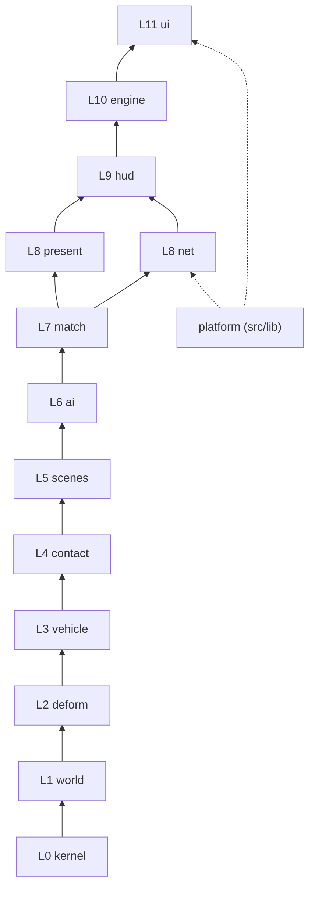

# Architecture and structural rules

How `src/` is cut into bounded contexts, which way dependencies may point, and the rules that keep the structure honest as
the game grows. The game is meant to be *correctly wobbly*: these rules govern structure, layering, ownership and test
correctness. They never pin a physics number, a feel, or an experiment (section 7).

Every rule that can be counted has a check in `scripts/check-boundaries.mjs`. A check prints a count; **a non-zero count is a
defect to fix, never a baseline to allow.** Until a check reaches 0 it is held by a ratchet: `scripts/boundary-caps.json` caps
every count at its value when the cap was set, `npm run check:boundaries` fails when a count rises above its cap, and the commit
that lowers a count lowers its cap. A check at 0 is then gated at 0 (section 9 has the counts these rules started from).

```
node scripts/check-boundaries.mjs            # one count per check, exit 1 if any is non-zero
node scripts/check-boundaries.mjs --list     # every violation as file:line
npm run check:boundaries                     # ratchet: exit 1 only if a count rises above scripts/boundary-caps.json
node scripts/dup-scan.mjs [--renamed]      # clone report (docs/audit/DUPLICATION.md)
```

## 1. Bounded contexts and the layer DAG

Each context is one folder, `src/game/<context>/` (`net` too); the files column below names the files in it. A production
file may import its own context or a context on a **strictly lower** layer. Type-only imports count: they couple
the same way. `platform` (`src/lib`) is reachable only from `net` and `ui`.



(Arrows point from the lower layer up to the layers allowed to use it.)

| L | context | files today | public API (what other contexts use) | owner module | active lane |
|---|---|---|---|---|---|
| 0 | **kernel**: number-only hot kernels and rig tables | `physics-core.js`, `shape-match-core.js` (+ `.d.ts`), `rig-spec.ts`, `rapier.ts` (the one Rapier loader) | `CRASH`, `TRANSFER`, `crushStroke`, `regionCrushBands`, `forceTransfer`, `crushGate`; `makeCluster`, `matchCluster`, `applyPlasticity`, `matchSkinLocal`; `CAGES`, `SENSORS`, `MASS_SPECS`, `BEAM_SPECS`, `SHAPE_CLUSTERS`; `loadRapier` | `physics-core.js` (crash maths), `rig-spec.ts` (rig data) | CrashRealism8 (`physics-core`) |
| 1 | **world**: ground, surfaces, track data | `ground.ts`, `world/catalog.ts`, `world/track-schema.ts`, `world/track.ts`, `world/placements.ts`, `world/tracks/*` | `Ground`, `activeGround`, `setGround`, `SURFACES`, `TrackFile`, `Track`, `placeProps`, `propColliders` | `world/track.ts` | none |
| 2 | **deform**: masses, clusters, cages, skin | `streamed-deform.ts` and its layers `deform-rig.ts` (with its builders in `deform-build.ts`), `deform-hit.ts`, `deform-state.ts`, `deform-contact.ts`, `deform-solve.ts`; `shape-match.ts`, `physics-util.ts`, `fast-normals.ts`, `deform-helper.ts`, `hulls.ts` | `StreamedDeformation`, `RigOverrides`, `DeformMode`, `computeNormalsFast`, `bleedAfterSlide`, `applyGroundFriction`, `HULLS`, `CRUSH_HULLS`, `Hull`, debug helpers | `streamed-deform.ts` | CrashRealism8 |
| 3 | **vehicle**: the car, its body styles, classes, drive and input | `car.ts` and its layers `car-core.ts`, `car-parts.ts`; `car-air.ts` (rigid flight and tumbling off the ground), `car-suspension.ts` (drawn per-wheel springs); `car-mesh.ts` (body geometry), `car-materials.ts` (shared textures / materials, small toned parts), `car-variants.ts`, `vehicle-classes.ts`, `lamp-lights.ts`, `car-drive.ts`, `drive-input.ts`, `gamepad.ts` | `DeformableCar`, `stepAir`, `Suspension`, `CAR_STYLES`, `CLASSES`, `HANDLING`, `killTravel`, `applyDrive`, `DriverSeat`, `DriveInput`, `GamepadInput` | `car.ts` | none |
| 4 | **contact**: car-car, car-wall, striker contact | `sat.ts`, `pair-contact.ts`, `external-contact.ts` | `physicsSlice`, `sliceSpeed`, `satCars`, `clipCarToBarrier`, `resolveCarPair`, `impulseCar`, `ContactBox`, `partContactPair` | `pair-contact.ts` | CrashRealism8 |
| 5 | **scenes**: rigs and props that act on cars | `fleet.ts`, `fleet-ramps.ts`, `corkscrew.ts`, `derby-arena.ts`, `compactor.ts`, `piston-rig.ts`, `door-rig.ts`, `range.ts`, `engine-props.ts` | `layoutFleet`, `MAX_CARS`, `FleetRamps`, `Corkscrew`, `CORKSCREW`, `clipToDerbyBowl`, `CompactorRig`, `PistonRig`, `DoorRig`, `RangeRun`, `JerseyBarrier` | one file per rig | DerbyAI2 (`derby-arena.ts`) |
| 6 | **ai**: drivers | `derby-ai.ts`, `ai-aggression.ts`, `ai/race-ai.ts`, `ai/traffic.ts` | `DerbyBrain`, `AiCar`, `RaceBrain`, `TrafficBrain`, `fieldAggression`, `mood` | `derby-ai.ts` / `ai/race-ai.ts` | DerbyAI2 (`derby-ai.ts`) |
| 7 | **match**: rules, scoring, campaigns | `derby.ts`, `match/session.ts`, `match/campaign.ts`, `match/types.ts` | `DerbyMatch`, `RaceSession`, `Campaign`, race event/HUD types | `match/session.ts`, `derby.ts` | DerbyAI2 (`derby.ts`) |
| 8 | **present**: FX, camera, cinematics, post, marks, world art | `engine-fx.ts`, `engine-camera.ts`, `engine-cine.ts`, `engine-post.ts`, `engine-marks.ts`, `engine-world.ts`, `engine-pistons.ts`, `engine-doors.ts`, `engine-ragdoll.ts` + `ragdoll-trigger.ts` + `ragdoll-mesh.ts` (thrown drivers), `range-art.ts` (the range's field and signs), `present/track-art.ts` (`TrackArt`) over `present/track-mesh.ts` (shared blocks), `present/track-ground.ts` (terrain, ribbons, markings, kerbs), `present/track-structures.ts` (walls, decks, tunnels), `present/prefabs.ts` | `DebrisSystem`, `SparkSystem`, `ChaseCamera`, `Cinematics`, `PostFX`, `FxTier`, `SkidMarks`, `WorldStage`, `PistonBank`, `DoorRam`, `TrackArt`, `RagdollSystem` | one file per system | PerfHitch |
| 8 | **net**: replication | `net/**` | `NetPlay`, `encode/decode` frames, `NetTransport` | `net/net-play.ts` | Netplay |
| 9 | **hud**: the read model the UI renders | `hud-store.ts`, `hud/menu-nav.ts` | `HudStore` (one per engine: CrashLab makes it, the engine publishes), `CrashHudState`, `KNOB_RANGES`, `INITIAL_HUD`, `navTarget` | `hud-store.ts` | none |
| 10 | **engine**: orchestration, the frame loop | `engine.ts` and its layers `engine-core.ts`, `engine-warm.ts`, `engine-hud.ts`, `engine-scenes.ts`, `engine-rigs.ts`, `engine-input.ts`; `world-step.ts`, `engine-race.ts` (`RaceDirector`: rules glue, menus, netplay, HUD) over `engine-race-field.ts` (`RaceField`: course, grid, spawns, respawns, traffic bubble, wall / prop contacts), `engine-trace.ts` | `CrashEngine` (the only public entry), `RaceDirector` | `engine.ts` | shared: CrashRealism8 (`fixedStep`), PerfHitch (renderer), Netplay (race wiring) |
| 11 | **ui**: React shell and HUD | `src/components/**`, `src/routes/**`, `src/router.tsx` | React components | `components/crash-lab.tsx` | HudLayout (`hud*.tsx`, `net-panel.tsx`) |
| - | **platform**: template server/client helpers | `src/lib/**` | `P2PRoom`, signaling, `qr`, `cn` | `src/lib/multiplayer` | Netplay (`multiplayer/`) |

Deploy (`deploy/`, `server/`, `scripts/` build helpers) sits outside `src/` and is not part of the DAG.

## 2. Boundary rules

- **B1.** Every production file under `src/` belongs to exactly one context. A new file is added to `CONTEXTS` in
  `scripts/check-boundaries.mjs` in the same commit. *Check C0.*
- **B2.** Imports follow the DAG: own context or strictly lower layer; `platform` only from `net`/`ui`; production never imports
  a `*.test.ts`, `*.test-util.ts` or `test-support.ts`. A lateral or upward need means a type or function is in the wrong
  context: move it down, do not add an exception. *Check C1.*
- **B3.** No import cycles between production files (value imports). *Check C2.*
- **B4.** Kernels (`*-core.js`) import nothing and never name `THREE`. They take numbers and typed arrays. *Check C3.*
- **B5.** Rule and data contexts (`kernel`, `world`, `ai`, `match`, `hud`, `net`) never name a scene-graph class (meshes,
  materials, geometries, lights, textures, cameras, groups). THREE maths types (`Vector3`, `Quaternion`, curves) are fine.
  *Check C4.*
- **B6.** An export exists because another production file imports it. Symbols used only in their own file are not exported;
  API only tests use lives in a `*.test-util.ts` beside the suite. *Check C5.*

## 3. Construction and ownership

- **O1.** `CrashEngine` is the single composition root: it constructs the cars, rigs, directors, `NetPlay`, FX systems and
  camera, and hands each one what it needs. No other production module constructs another context's top-level object
  (tests may build any object directly).
- **O2.** No module-level mutable state. World state (the HUD snapshot, the tyre-mark bounds) hangs off an object the engine
  owns, so a second engine, a replay or a test never inherits it. Module-scope `const` scratch vectors are fine (rule H3),
  and so is a lazily built constant (a texture, a material, a table) behind `scalar.ts` `once`: it never changes once made.
  *Check C10* (module-level `let`/`var`); exported `const` objects mutated at runtime (e.g. `HANDLING.realism` in
  `vehicle-classes.ts`) are the same defect and are fixed with them (not yet counted by a check).
  The one accepted row is `ground.ts`'s active ground: a scene-scoped singleton. It is read from the per-mass loops of every
  car, the drive, loose parts, FX and marks (13 production files); threading it through cars and FX would touch all of them
  and every ground test for no behaviour change, because one world steps per process (one engine per page; harnesses and
  tests run one world at a time and restore the flat ground). Its writers are the scene reset and the race director (O3).
  Two live worlds in one process need it threaded first: `world/race-replay.test.ts` runs its worlds one after another
  because leaving a race restores the flat ground for everyone.
- **O3.** One writer per piece of state: the context that owns a value is the only one that assigns it (e.g. `setGround` is
  called by the engine context only: the scene reset and the race director). Other contexts read it through the owner's API.
- **O4.** Whoever creates a GPU resource (geometry, material, texture, render target) disposes it, in the same file. Shared
  resources are marked shared at creation and disposed by their creator.
- **O5.** Copies of production behaviour are not allowed anywhere, tests included: a test that needs the step, a contact rule
  or a formula imports it (see T1).

## 4. Hot path

- **H1.** The per-frame entry points and the per-pair/per-slice queries they call (`HOT` in the script: `tickInner`,
  `fixedStep`, `syncPose`, `updateDeform`, `hulls`, `stepStructure`, `collideWith`, `physicsSlice`, `resolveCarPair`,
  `applyDrive`, the AI `think`s, `DerbyMatch.step`, …) allocate nothing: no `new`, no `.clone()`, no array or object literal,
  no closure. Results go into caller-owned `out` objects. *Check C6* (it also reports a `HOT` name that no longer exists).
- **H2.** Per-particle, per-vertex and per-hull data live in typed arrays (`Float32Array`/`Float64Array`/`Uint8Array`) or
  preallocated objects sized at construction; growth happens only on a cold path (spawn, rig change).
- **H3.** Scratch objects are module- or instance-scope `const`s named `_x`, used within one call and never returned.
- **H4.** A hot loop moves into a plain-JS `*-core.js` kernel (typed by a sibling `.d.ts`) only when `npm run bench` shows the
  TypeScript build costing time; otherwise it stays in TypeScript.

## 5. Tests

- **T1.** Tests drive the production entry points: the engine's own step and phase machine, the real rig, the real contact
  rule. A harness may assemble a scene (which cars, which rig) but never re-implements the loop or a rule. Today 4 loop copies
  and 3 rule copies violate this (docs/audit/DUPLICATION.md D1-D3); they are removed by REFACTOR_PLAN S6.
- **T2.** Fail before you pass: a new behaviour test is seen red once, by breaking the production line it covers, before it
  is trusted.
- **T3.** Assert behaviour the player sees (crush metres, kill speeds, who wins, laps, what a client renders), not wiring,
  forwarding, copies of a constant or source text.
- **T4.** Never deep-compare two computed values (`deepEqual`, `deepStrictEqual`, `notDeep*`). `node:assert` diffs both sides
  when it fails, and on two ~75k-element float arrays one failing assert took a single process to 14.7 GB and the VM down
  (2026-10-02). One side must be a literal; buffers and replays are compared by first mismatch index plus max |diff|, or by a
  hash. *Check C9.*
- **T5.** Deterministic: fixed `dt`, seeded randomness in anything a test measures, no wall-clock reads in the sim. An
  intermittent red is an undiagnosed bug.
- **T6.** Bounded: traces and per-frame captures use ring buffers or fixed caps; every test, probe and sweep runs under a
  memory cap (a cgroup `MemoryMax` wrapper) so a runaway dies alone.

## 6. Tuning knobs

- **K1.** A knob is a named value: a row in a data table (`rig-spec.ts`, `vehicle-classes.ts` `CLASSES`, `physics-core.js`
  `CRASH`/`TRANSFER`, `world/catalog.ts` `SURFACES`, `hud-store.ts` `KNOB_RANGES`) or a module `const`. Inline magic numbers in
  sim code are promoted when touched.
- **K2.** Every knob carries a comment saying where the number comes from: a source (paper, standard, real-world figure, doc
  section) or a measurement (test, sweep cell, probe, A/B). "Guessed, feels right" is a valid source while the knob is being
  tuned; it says so. One comment may head a block of related consts. *Check C7.*
- **K3.** Knobs the player can move go through `KNOB_RANGES` with defaults in `INITIAL_HUD`; `knob-defaults.test.ts` pins the
  calibrated defaults, not the code path.

## 7. Wobbly allowances (explicitly allowed)

- **W1. Tuning values change freely.** Moving a knob needs its K2 comment updated and the covering suite re-run. No rule,
  check or review pins a value.
- **W2. Experiment flags.** A named boolean or enum with a documented default may keep two behaviours side by side while an
  A/B runs. Both paths compile and are exercised; the loser is deleted when the A/B decides.
- **W3. Todo tests.** A documented target the physics does not meet yet stays as `it.todo(…)` or `{ todo: REASON }` with the
  measured value in the reason (the piston `TODO` map, contact-parity `PENDING`). It still runs; the todo is removed in the
  commit that makes it pass.
- **W4. Visual cheats.** Effects, camera and lighting may ignore physics (`docs/DESIGN_PILLARS.md` 1). The cheat lives in
  `present`, never in a sim context.
- **W5. Table rows look alike.** Repeated rows in data tables are not duplication (rule D in DUPLICATION.md).

## 8. Size

- **S1.** Production files ≤ 800 lines, functions ≤ 150 lines. A file over the cap is split along its contexts the next time
  it is changed substantially. *Check C8.*

## 9. Current state (2026-10-02, main `3f8eb23`)

`node scripts/check-boundaries.mjs` (exit 1):

```
C0    0  files outside every context
C1    5  imports against the layer DAG
C2    0  import cycles (strongly connected file groups)
C3    0  kernel purity breaks
C4    0  scene-graph names in rule/data contexts
C5  111  exports with no production importer
C6   35  allocations in per-frame entry points
C7   17  uncommented numeric knobs
C8   12  size caps exceeded
C9   17  test deep-compares of two computed values
C10   10  module-level mutable bindings
total 207
```

| check | rule | count | the violations |
|---|---|---|---|
| C0 | B1 | 0 | - |
| C1 | B2 | 5 | `streamed-deform.ts:19` → `car-mesh.ts` (`HULLS`, `CRUSH_HULLS`, `Hull`: hull data belongs in deform/kernel); `physics-util.ts:2` → `car.ts` (type `DeformableCar`); `engine-props.ts:6` → `engine-world.ts` (`makeJerseyBarrier`); `engine-props.ts:7` → `engine-fx.ts` (types `DebrisSystem`, `SparkSystem`); `net/net-play.ts:3` → `hud-store.ts` (type `CrashPhase`, belongs with the phase machine, D2) |
| C2 | B3 | 0 | - |
| C3 | B4 | 0 | - |
| C4 | B5 | 0 | - |
| C5 | B6 | 111 | 80 exported but used only in their own file; 23 imported only by tests (`firePiston`, `fireRam`, `pistonLocality`, `stepCarPair`, `tyreOverlap`, `travelOf`, `restSideProfile`, `cornerSpeed`, `separateSphereFromBounds`, `TrackFile`, 3 `physics-util` re-exports, 10 `shape-match` re-exports); 8 used nowhere (`crushedHulls`, `raceMaterials`, the `engine.ts:46` type re-export, 5 `shape-match` re-exports) |
| C6 | H1 | 35 | `streamed-deform.ts` `liveHulls`/`liveCrushHulls` 12 (5 hull literals + array each); `pair-contact.ts` `resolveCarPair` 8 (2 closures; 2 returns, each a literal + 2 clones); `car.ts` `hulls`/`crushHulls` 4 closures; `derby.ts` `step` 6; `sat.ts` `satTwoHulls` axes array + `satCars` closure; `engine.ts` `stepDerby` 2, `updateCamera` 1 |
| C7 | K2 | 17 | `car-mesh.ts` 8 (`ARCH_R`, `Y_FLOOR`, `DOOR_Z0/Z1`, `DOOR_EDGE`, `TUB_EDGE`, `SEAM_HALF`, `BASE_SLICES`); `derby-arena.ts` 3; `fleet.ts` 2 (`MAX_CARS`, `FLEET_MIN_SEP`); `physics-core.js` `FRONTAL_REF`; `sat.ts` `BARRIER_MASS`; `shape-match-core.js` `ROT_MAX_ITER`, `ROT_CLAMP` |
| C8 | S1 | 12 | files: `streamed-deform.ts` 3380, `engine.ts` 2140, `car.ts` 1483, `present/track-art.ts` 1314, `car-mesh.ts` 1161, `engine-race.ts` 1002, `shape-match-core.js` 801; functions: `StreamedDeformation` constructor 221, `engine.ts` `fixedStep` 173, `streamed-deform.ts` `clampLocal` 162, `car-drive.ts` `applyDrive` 154, `track-art.ts` `buildTerrain` 151 |
| C9 | T4 | 17 | `car-variants.test.ts` 76, 84, 86, 93; `contact-parity.test.ts` 10; `derby.test.ts` 119; `door-rig.test.ts` 73; `gamepad.test.ts` 69; `net/net.test.ts` 148, 214; `world/placements.test.ts` 35, 36 (98-213 props per track, the largest today); `ai/race-ai.test.ts` 168, 169; `match/session.test.ts` 331, 335, 377 |
| C10 | O2 | 10 | `car-mesh.ts` 885-887, 998, 999, 1152 (lazy texture/material caches); `deform-helper.ts:461` `scaleTexture`; `engine-marks.ts:33` `boundsEpoch`; `ground.ts:40` `active`; `hud-store.ts:184` `snapshot` |

Uncounted, measured by reading: T1 has 7 violations (4 copied loops, 3 copied rules: DUPLICATION.md D1-D3); O2 has at least
one mutated exported const (`HANDLING.realism`).

## 10. Changing these rules

A rule changes by editing this file and `scripts/check-boundaries.mjs` in the same commit, with the reason in the commit
body. Adding a file to a context, a name to `HOT`, or a context to the DAG is a normal change; adding an exception list is not.
