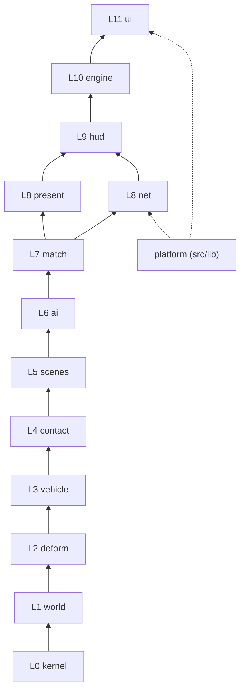

# Architecture and structural rules

How `src/` is cut into bounded contexts, which way dependencies may point, how a frame runs, and the rules that keep the
structure honest as the game grows. The game is meant to be *correctly wobbly*: these rules govern structure, layering,
ownership and test correctness. They never pin a physics number, a feel, or an experiment (section 7).

Every rule that can be counted has a check in `scripts/check-boundaries.mjs`. A check prints a count; **a non-zero count is a
defect to fix, never a baseline to allow.** Until a check reaches 0 it is held by a ratchet: `scripts/boundary-caps.json` caps
every count at its value when the cap was set, `npm run check:boundaries` fails when a count rises above its cap, and the commit
that lowers a count lowers its cap. C8 (size) is report-only.

```
node scripts/check-boundaries.mjs            # one count per check, exit 1 if any is non-zero
node scripts/check-boundaries.mjs --list     # every violation as file:line
npm run check:boundaries                     # ratchet: exit 1 only if a count rises above scripts/boundary-caps.json
node scripts/dup-scan.mjs [--renamed]        # clone report on stdout
```

## 1. Bounded contexts and the layer DAG

Each context is one folder, `src/game/<context>/`. A production file may import its own context or a context on a
**strictly lower** layer. Type-only imports count: they couple the same way. `platform` (`src/lib`) is reachable only from
`net` and `ui`.



(Arrows point from the lower layer up to the layers allowed to use it.)

| L | context | owns | main entry points |
|---|---|---|---|
| 0 | **kernel** | number-only hot kernels and rig tables: `physics-core.js`, `shape-match-core.js` (typed by `.d.ts`), `rig-spec.ts`, `rapier.ts` (the one Rapier loader) | `CRASH`, `crushStroke`, `CAGES`, `MASS_SPECS`, `loadRapier` |
| 1 | **world** | ground, surfaces, track data and courses (`world/tracks/*.json`) | `Ground`, `activeGround`, `setGround`, `SURFACES`, `Track`, `placeProps` |
| 2 | **deform** | masses, clusters, cages, skin, load crush, the WASM skin kernel | `StreamedDeformation` (layers `deform-rig` → `deform-hit` → `deform-state` → `deform-contact` → `deform-solve`) |
| 3 | **vehicle** | the car, body styles, classes, parts, glass, lamps, drive and input | `DeformableCar` (layers `car-core` → `car-parts` → `car`), `CLASSES`, `HANDLING`, `applyDrive`, `DriverSeat` |
| 4 | **contact** | car-car, car-wall, car-prop and striker contact | `physicsSlice`, `satCars`, `resolveCarPair`, `partContactPair` |
| 5 | **scenes** | rigs and props that act on cars, one file per rig | `layoutFleet`, `FleetRamps`, `Corkscrew`, `CompactorRig`, `PistonRig`, `DoorRig`, `StackRig`, `RangeRun`, `JerseyBarrier` |
| 6 | **ai** | drivers: derby, race, traffic, police, Survival hunters | `DerbyBrain`, `RaceBrain`, `TrafficBrain`, `PoliceBrain`, `HunterBrain` |
| 7 | **match** | rules, scoring, campaigns, the crash phase machine | `DerbyMatch`, `RaceSession`, `Campaign`, `AutoWatch`, `CrashPhase` |
| 8 | **present** | FX, camera, cinematics, post, marks, world art, ragdolls | `ChaseCamera`, `Cinematics`, `PostFX`, `TrackArt`, `RagdollSystem`, `Witness`, `SceneFade` |
| 8 | **net** | replication over WebRTC | `NetPlay`, the codecs, `NetTransport`, `findMatch` |
| 9 | **hud** | the read model the UI renders | `HudStore`, `CrashHudState`, `KNOB_RANGES`, `INITIAL_HUD`, the share URL |
| 10 | **engine** | orchestration and the frame loop | `CrashEngine` (the only public entry), `RaceDirector` |
| 11 | **ui** | React shell and HUD: `src/components/**`, `src/routes/**`, `src/router.tsx` | `crash-lab.tsx` |
| - | **platform** | template server/client helpers: `src/lib/**` | `P2PRoom`, signaling, `qr`, `cn` |

Deploy (`deploy/`, `server/`, `scripts/` build helpers) sits outside `src/` and is not part of the DAG.

## 2. Boundary rules

- **B1.** Every production file under `src/` belongs to exactly one context (its folder). *Check C0.*
- **B2.** Imports follow the DAG: own context or strictly lower layer; `platform` only from `net`/`ui`; production never imports
  a `*.test.ts`, `*.test-util.ts` or `test-support.ts`. A lateral or upward need means a type or function is in the wrong
  context: move it down, do not add an exception. *Check C1.*
- **B3.** No import cycles between production files (value imports). *Check C2.*
- **B4.** Kernels (`*-core.js`) import nothing and never name `THREE`. They take numbers and typed arrays. *Check C3.*
- **B5.** Rule and data contexts (`kernel`, `world`, `ai`, `match`, `hud`, `net`) never name a scene-graph class (meshes,
  materials, geometries, lights, textures, cameras, groups). THREE maths types (`Vector3`, `Quaternion`, curves) are fine.
  *Check C4.*
- **B6.** An export exists because another production file imports it. Symbols used only in their own file are not exported;
  API only tests use lives in a `*.test-util.ts` beside the suite. *Check C5.*
- **B7.** No `implements` in `src/game` (tests included): it only re-declares a shape and lets each class re-implement the
  same logic. A family of classes extends one base class that holds what they share (`CopBrain`, `NetTransport`,
  `RigLayer`). *Check C11*, capped at the 4 `Ground` implementers.

## 3. Construction and ownership

- **O1.** `CrashEngine` is the single composition root: it constructs the cars, rigs, directors, `NetPlay`, FX systems and
  camera, and hands each one what it needs. No other production module constructs another context's top-level object
  (tests may build any object directly).
- **O2.** No module-level mutable state. World state hangs off an object the engine owns, so a second engine, a replay or a
  test never inherits it. Module-scope `const` scratch vectors are fine (rule H3), and so is a lazily built constant behind
  `scalar.ts` `once`. *Check C10* (module-level `let`/`var`). The one accepted row is `ground.ts`'s active ground, a
  scene-scoped singleton read from every per-mass loop; one world steps per process, and its writers are the scene reset and
  the race director (O3).
- **O3.** One writer per piece of state: the context that owns a value is the only one that assigns it. Other contexts read it
  through the owner's API.
- **O4.** Whoever creates a GPU resource (geometry, material, texture, render target) disposes it, in the same file. Shared
  resources are marked shared at creation and disposed by their creator; `renderer.info.memory` stays flat across resets and
  scene switches.
- **O5.** Copies of production behaviour are not allowed anywhere, tests included: a test that needs the step, a contact rule
  or a formula imports it (see T1). One job, one implementation.

## 4. Hot path

- **H1.** The per-frame entry points and the per-pair/per-slice queries they call (`HOT` in the script: `tickInner`,
  `fixedStep`, `stepWorld`, `syncPose`, `updateSkin`, `stepStructure`, `collideWith`, `physicsSlice`, `resolveCarPair`,
  `applyDrive`, the AI `think`s, `DerbyMatch.step`, …) allocate nothing: no `new`, no `.clone()`, no array or object literal,
  no closure, no `.push`. Results go into caller-owned `out` objects. *Check C6.*
- **H2.** Per-particle, per-vertex and per-hull data live in typed arrays or preallocated objects sized at construction;
  growth happens only on a cold path (spawn, rig change).
- **H3.** Scratch objects are module- or instance-scope `const`s named `_x`, used within one call and never returned.
- **H4.** Inside per-step and per-frame functions: indexed `for` loops, no `try`/`catch`, `arguments`, recursion or
  `for…of`, monomorphic shapes. A hot loop moves into a plain-JS `*-core.js` kernel (typed by a sibling `.d.ts`) only when
  `npm run bench` shows the TypeScript build costing time.

## 5. Tests

- **T1.** Tests drive the production entry points: the engine's own step (`stepWorld`, `engine/world-step.ts`), the phase
  machine (`match/phase.ts`), the real rig, the real contact rule. A harness may assemble a scene but never re-implements
  the loop or a rule.
- **T2.** Fail before you pass: a new behaviour test is seen red once, by breaking the production line it covers.
- **T3.** Assert behaviour the player sees (crush metres, kill speeds, who wins, laps, what a client renders), not wiring,
  forwarding, copies of a constant or source text. Test text reads given / when / then in behaviour terms; cases of the
  same shape are one flat table.
- **T4.** Never deep-compare two computed values (`deepEqual`, `deepStrictEqual`, `notDeep*`): on large float arrays the
  failure diff alone can exhaust memory. Buffers and replays are compared by first mismatch index plus max |diff|
  (`assertSameNumbers`) or by a hash (`assertSameDigest`). *Check C9.*
- **T5.** Deterministic: fixed `dt`, seeded randomness in anything a test measures, no wall-clock reads in the sim. An
  intermittent red is an undiagnosed bug.
- **T6.** Bounded: traces and per-frame captures use ring buffers or fixed caps; every test, probe and sweep runs under a
  memory cap so a runaway dies alone.

Runner: `node --test` semantics with `--experimental-strip-types` (no test framework), through `scripts/run-tests.mjs`, which
starts the slowest files first (`scripts/test-cost.json`; `--learn` refreshes it) and otherwise behaves like the CLI. `npm run test:app` runs the game and
multiplayer suites, `npm run test:game` only `src/game`. Harnesses: `contact/crash-scenarios.test-util.ts` (headless crash
scenarios at the engine's slices), `scenes/contact-parity.test-util.ts` (striker vs car), `world/race-world.test-util.ts`
(the whole race stack headless), `vehicle/test-support.ts` (`forModes`, `DT`).

## 6. Tuning knobs

- **K1.** A knob is a named value: a row in a data table (`rig-spec.ts`, `vehicle-classes.ts` `CLASSES`, `physics-core.js`
  `CRASH`/`TRANSFER`, `world/catalog.ts` `SURFACES`, `hud-store.ts` `KNOB_RANGES`) or a module `const`. Inline magic numbers in
  sim code are promoted when touched.
- **K2.** Every knob carries a comment saying where the number comes from: a source (paper, standard, real-world figure, doc
  section) or a measurement (test, sweep cell, probe, A/B). "Guessed, feels right" is a valid source while the knob is being
  tuned; it says so. *Check C7.*
- **K3.** Knobs the player can move go through `KNOB_RANGES` with defaults in `INITIAL_HUD`; `knob-defaults.test.ts` pins the
  calibrated defaults.

## 7. Wobbly allowances (explicitly allowed)

- **W1. Tuning values change freely.** Moving a knob needs its K2 comment updated and the covering suite re-run.
- **W2. Experiment flags.** A named boolean or enum with a documented default may keep two behaviours side by side while an
  A/B runs. Both paths compile and are exercised; the loser is deleted when the A/B decides.
- **W3. Pooled outcome bars.** Game outcomes and pacing over seeded runs may be pooled ("≥ N of M heats have a winner within
  T"). Physics rules (spin ceilings, zips, sinking, penetration, ramp contact) hold on every run.
- **W4. Visual cheats.** Effects, camera and lighting may ignore physics (`docs/DESIGN_PILLARS.md` 1). The cheat lives in
  `present`, never in a sim context.
- **W5. Table rows look alike.** Repeated rows in data tables are not duplication.

## 8. Size

- **S1.** Production files ≤ 800 lines, functions ≤ 150 lines. *Check C8*, report-only.

## 9. Code map

**Engine.** `CrashEngine` is one class in layers, each extending the one before: `engine-core` (state, car roster, shared
queries) → `engine-warm` (shader warm-up, skin kernel) → `engine-hud` (`emitHud`) → `engine-derby` (derby on / off, its netplay
mirror) → `engine-scenes` (scene picker, fade, reset, derby step) → `engine-rigs` (press, pistons, doors) → `engine-input` (keys, pad, HUD commands, `advance`) → `engine-reel`
(crash highlights) → `engine-share` (the `#` URL) → `engine.ts`. `window.__crush` is the live engine (benches and probes).
A race runs through `RaceDirector` (`engine-race.ts`) over `RaceField` (`engine-race-field.ts`).

**Frame** (`CrashEngine.tickInner`, wall `dt` ≤ 0.1 s):

```
pollInput → stepSceneFade → fxFrame
if playing:  simDt = wallDt × timeScale × cine.timeWarp
             SimPacer.run: whole fixedSteps of physicsSlice(cars) against an 8 ms budget (sim-pace.ts)
               fixedStep: race.drive / applyDrive (seat, derby AI, net peers) → stepWorld (1–3 slices: integrate,
                          pair + part contact, SAT passes, stepStructure, clips) → ejections → race.step → cinematic trigger
             stepEdge → scheduleSkins (Witness: off-camera cars defer, small ones stride) → updateSkin
             updatePhase → rigs → FX, ragdolls, smoke, trace → stepDerby → seat.step → cine.update
always:      net.frame → PoseBlend.present → race.frame → updateCamera → flushVisibleSkins → detail / lamps
             → cine.render → PoseBlend.restore → emitHud every 0.05–0.12 s
```

`Witness` (`present/witness.ts`) is the one "could the camera see this?" test behind every cosmetic skip (skins, sparks,
debris, smoke). It never gates the sim, audio or marks.

**Scenes** (`scenes/scene-id.ts` `SCENE_IDS`, one at a time via `setScene`): fleet (default, with the barrier, ramp balls
and jump ramps as props), press, pistons, doors, corkscrew, stack, derby, race, range, survival. A pick fades through the
cel look and black (`SceneFade`); `__crush.fadeScenes = false` skips it for probes. Keys: `docs/CONTROLS.md`.

**HUD.** `CrashEngine.emitHud` → `HudStore.publish(snapshot)` → `useSyncExternalStore` in `crash-lab.tsx` → `components/hud*.tsx`.
The HUD calls engine setters and `raceCommand(cmd)`; it never touches sim state.

**Kernels.** `kernel/physics-core.js` and `kernel/shape-match-core.js` are plain JS with `.d.ts` types (TypeScript's emit
was several times slower on these loops). `deform/skin-kernel.wasm` is the skin and normals loop, built from
`kernels/skin/` by `npm run build:kernel` and committed; the JS skin stays the reference and the fallback.

## 10. Changing these rules

A rule changes by editing this file and `scripts/check-boundaries.mjs` in the same commit, with the reason in the commit
body. Adding a file to a context, a name to `HOT`, or a context to the DAG is a normal change; adding an exception list is not.
