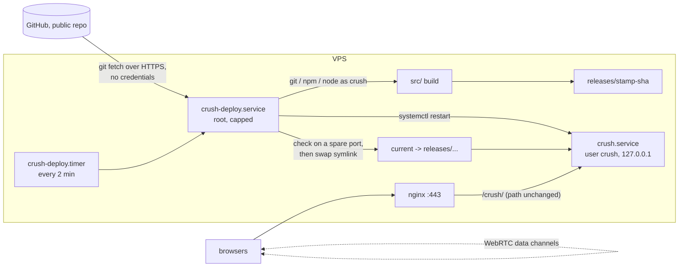

# Deploying

Two targets build from the same tree:

| Target | Build | Base path | Signaling database |
|---|---|---|---|
| Vercel (default) | `npm run build` (Nitro `vercel` preset) | `/` | Neon via `DATABASE_URL` |
| Self-hosted node server | `npm run build:node` (Nitro `node-server` preset), run with `npm run start:node` | `APP_BASE`, e.g. `/crush/` | PGLite in `PGLITE_DATA_DIR` |

## Build knobs

Both are read by `vite.config.ts` at build time; neither reaches the browser (only `VITE_`
variables do).

- `NITRO_PRESET`: the Nitro server target. Unset means `vercel`. `build:node` sets `node-server`
  through `scripts/with-app-env.mjs`, which accepts leading `NAME=value` arguments so the npm script
  also runs on Windows. The node build ships PGLite's whole package (its `.wasm` and `.data` load
  from beside the module), so `.output/` runs on its own with no `node_modules`.
- `APP_BASE`: the sub-path the app is served under, both slashes (`/crush/`); default `/`. It
  becomes Vite's `base`. TanStack Start derives the router basepath from it and Nitro gets it as
  `baseURL`, so pages, `/_serverFn`, `/api/rtc` and public files all live under it. Client code
  builds URLs from `import.meta.env.BASE_URL` (always ends in `/`), never from a
  hard-coded `/`: `${import.meta.env.BASE_URL}api/rtc`, `${import.meta.env.BASE_URL}env-studio.jpg`,
  and for share links `location.origin + import.meta.env.BASE_URL + "?net=join&room=X"`. A
  request outside the base gets a redirect to it.

  The exception is the platform chrome (`server/middleware/grok-pwa.ts`, `scripts/grok-pwa-*`,
  `public/__grok/`), which is not ours to edit and keeps root-relative URLs: the manifest and
  touch-icon links, the iOS install page's assets under `/__grok/`, and the share-card images
  (`og:image` → `/og.jpg`, `x:game:image` → `/x-banner.jpg`). The proxy routes those root paths to
  the app (`deploy/nginx-crush.conf`); the manifest is served by the middleware at the root path,
  the rest from the app's public files under the base. One known limit: the manifest's
  `start_url`/`scope` are `/`, so a home-screen install opens the site root, not the base.

Runtime variables for the node server: `PORT` (default 3000), `HOST`, `PGLITE_DATA_DIR`
(unset = in-memory, wiped on restart), `DATABASE_URL` (set it to use Postgres instead of PGLite).
A PGLite data dir belongs to one process: PGLite has no cross-process locking.

Signaling rows live 30-60 s, so a persistent PGLite store matters little: it keeps rooms across a
restart that happens mid-handshake, nothing more.

## Self-hosted: architecture



One pass of `deploy/crush-deploy.sh`:

1. Take a lock (a pass that is still building makes the next tick exit at once).
2. `git fetch` the branch. Same commit as `current/REVISION`, or a commit marked failed: exit. This
   is the whole cost of an idle poll.
3. Defer if the 1-minute load average is at or above the core count.
4. As the `crush` user: check out the commit, `npm ci`, `npm run build:node` with `APP_BASE`, copy
   `.output` to `releases/<UTC stamp>-<sha>`.
5. Start that release on `CRUSH_CHECK_PORT` with an in-memory database. The page and
   `api/rtc` must both answer within 45 s.
6. Point `current` at it with `ln -sfn` + `mv -T` (atomic rename), `systemctl restart crush.service`,
   and check the live port the same way.
7. Keep the newest `CRUSH_KEEP` releases (never the live or the previous one).

Failure at 4 or 5 leaves the live release untouched. Failure at 6 swaps `current` back and
restarts again. Either way the commit is recorded as `state/failed-<sha>` and skipped until a newer
commit arrives or someone deletes the marker.

Limits: the deploy unit runs at `Nice=10`, `CPUWeight=20`, `CPUQuota=200%`, idle I/O class,
`MemoryMax=4G`, `OOMScoreAdjust=500`; `crush.service` at `Nice=5`, `CPUWeight=20`,
`MemoryMax=2G`, `OOMScoreAdjust=500`, `ProtectSystem=strict` with only its data dir writable.
(PGLite is the memory cost: ~1.2 GB peak while it opens a database, ~0.4-0.6 GB after.)
On a box shared with other services, those services win any contention and are never the OOM
killer's first pick.

Root does three things in a pass: swap a symlink, run `systemctl`, run `curl`. Everything that
reads repository content (git, npm and its install scripts, the built server) runs as `crush`
through `setpriv` with a clean environment. The deploy script itself is installed by hand from the
repo; the box never runs a fetched copy of it as root.

Install steps: [deploy/README.md](../deploy/README.md).

## Why pull, not a GitHub Actions runner on the box

This repository is public. A self-hosted runner registered to a public repo runs whatever workflow
a pull request brings: a fork can add `.github/workflows/x.yml` with `runs-on: self-hosted` and get
a shell on the box, as the runner user, next to the other services. GitHub's own docs say to use
self-hosted runners only with private repositories for that reason.

The pull model has no inbound path at all:

- Nothing on GitHub can make the box run anything. The box decides when to look and only ever
  builds the head of one named branch, which only people with push access can move.
- No credentials exist: the fetch is anonymous HTTPS, there is no runner token, no deploy key, no
  secret in Actions.
- Code from the repo runs as an unprivileged user with no sudo, inside a capped cgroup.

What it costs: up to two minutes plus build time between a push and the deploy, and no "deploy"
status on the commit in GitHub. The journal (`journalctl -u crush-deploy.service`) is the record.

What it still trusts: anyone who can push to `main` can run code as `crush` on the box. Branch
protection on `main` is the control for that, the same as with any CD system.

## Rolling back

Automatic: a release that fails its checks never goes live, or is swapped back (step 6).

By hand, on the box, from the deploy root:

```bash
touch "state/failed-$(cat current/REVISION)"     # stop the next poll from redeploying it
ls releases
ln -sfn releases/<older> current.new && mv -fT current.new current && systemctl restart crush.service
```

Or revert the commit on `main`; the next poll deploys the revert like any other commit.

## If the owner insists on a self-hosted runner

Not recommended for this public repo. If it is done anyway:

- Register it to this repo only, under its own unprivileged user with no sudo, in a systemd unit
  with the same limits as `crush-deploy.service` (`Nice`, `CPUWeight=20`, `MemoryMax`,
  `OOMScoreAdjust=500`).
- Settings > Actions > General: "Require approval for all outside collaborators" (fork pull requests
  wait for a maintainer before any workflow runs).
- The deploy workflow triggers on `push` to `main` only, plus `workflow_dispatch`. No
  `pull_request`, `pull_request_target` or `issue_comment` triggers anywhere in the repo, since
  a workflow file in a PR can target any label.
- Give the job `permissions: contents: read` and no secrets; it needs none.
- Give the runner a label nothing else uses and keep it out of every other workflow.
- The job does exactly what one pull pass does (build as the runner user, health-check, swap,
  restart). Restarting `crush.service` from the runner needs a narrow sudoers rule or polkit rule
  for that one unit, which is privilege the pull model never grants.

Risks that remain: the approval policy is a click away from being relaxed; a maintainer can approve
a malicious fork PR by mistake; any workflow added later with a PR trigger reopens the hole; and
the runner's stored credentials, if stolen from the box, let another machine pose as it and take
this repo's jobs. Hosted runners plus a pull-based box avoid all of these.
