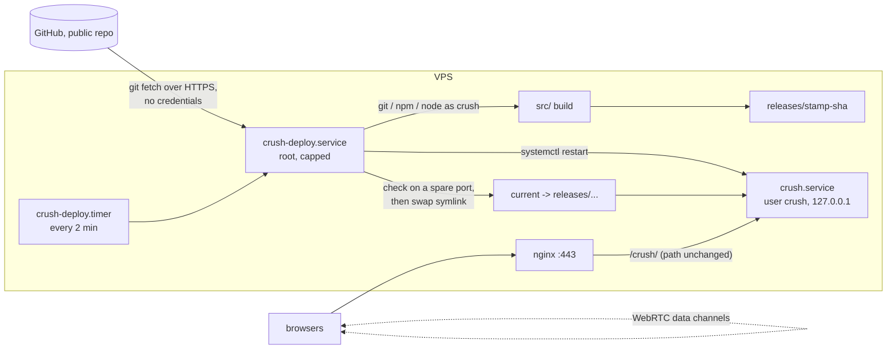

# Deploying

Two targets build from the same tree:

| Target | Build | Base path | Signaling database |
|---|---|---|---|
| Vercel (default) | `npm run build` (Nitro `vercel` preset) | `/` | Neon via `DATABASE_URL` |
| Self-hosted node server | `npm run build:node` (Nitro `node-server` preset), run with `npm run start:node` | `APP_BASE`, e.g. `/crush/` | PGLite in `PGLITE_DATA_DIR` |

## Build knobs

Both are read by `vite.config.ts` at build time; neither reaches the browser (only `VITE_`
variables do).

- `NITRO_PRESET`: the Nitro server target. Unset means `vercel`. `build:node` sets `node-server`
  through `scripts/with-app-env.mjs`, which accepts leading `NAME=value` arguments so the npm script
  also runs on Windows. The node build ships PGLite's whole package (its `.wasm` and `.data` load
  from beside the module), so `.output/` runs on its own with no `node_modules`.
- `APP_BASE`: the sub-path the app is served under, both slashes (`/crush/`); default `/`. It
  becomes Vite's `base`. TanStack Start derives the router basepath from it and Nitro gets it as
  `baseURL`, so pages, `/_serverFn`, `/api/rtc` and public files all live under it. Client code
  builds URLs from `import.meta.env.BASE_URL` (always ends in `/`), never from a
  hard-coded `/`: `${import.meta.env.BASE_URL}api/rtc`, `${import.meta.env.BASE_URL}env-studio.jpg`,
  and for share links `location.origin + import.meta.env.BASE_URL + "?net=join&room=X"`. A
  request outside the base gets a redirect to it.

  The exception is the platform chrome (`server/middleware/grok-pwa.ts`, `scripts/grok-pwa-*`,
  `public/__grok/`), which is not ours to edit and keeps root-relative URLs: the manifest and
  touch-icon links, the iOS install page's assets under `/__grok/`, and the share-card images
  (`og:image` → `/og.jpg`, `x:game:image` → `/x-banner.jpg`). The proxy routes those root paths to
  the app (`deploy/nginx-crush.conf`); the manifest is served by the middleware at the root path,
  the rest from the app's public files under the base. One known limit: the manifest's
  `start_url`/`scope` are `/`, so a home-screen install opens the site root, not the base.

Runtime variables for the node server: `PORT` (default 3000), `HOST`, `PGLITE_DATA_DIR`
(unset = in-memory, wiped on restart), `DATABASE_URL` (set it to use Postgres instead of PGLite).
A PGLite data dir belongs to one process: PGLite has no cross-process locking. It must also be
closed on stop: `db.ts` closes it on SIGTERM/SIGINT. Measured without that: a server that opens a
data dir left unclean (its previous owner was killed or never closed it) crash-recovers it and then
keeps a PGLite timer (`__setitimer_js`) armed forever, so it never exits on SIGTERM. On the box that
was a 90 s stop timeout and a SIGKILL on every deploy, which left the store unclean again for the
next release. With the close, the same scenario exits in about 2 s and leaves the store clean.
Normally the server's own SIGTERM handler (srvx) closes the HTTP server and the process ends by
itself; srvx skips that when `CI` or `TEST` is set, and a signal listener cancels Node's default
exit, so `db.ts` ends the process itself when no other listener for the signal remains.

Signaling rows live 30-60 s, so a persistent PGLite store matters little: it keeps rooms across a
restart that happens mid-handshake, nothing more.

## Submissions and the update check

The game posts three kinds of submission to `<base>api/submissions` (`src/lib/submissions/`): a bench card (`?bench=`, the Benchmark loop), a JSON trace capture (Debug views > Submit) and a flagged replay clip ([!] over the results reel and a solo view). Each carries the build sha (`__BUILD_SHA__`), user agent, screen and pixel ratio, scene settings and the client clock, and gets back a receipt id. Rows go in the `submissions` table (`migrations/0006_submissions.sql`) of the same database as signaling, so on the box they sit under `PGLITE_DATA_DIR` in `shared/` and survive deploys. The table is capped at 5000 rows and 128 MB of stored (gzipped, base64) text; a post past either answers 507 and evicts nothing. Caps per kind, measured on real captures, are in `src/lib/submissions/kinds.ts`; one post is processed at a time (a 16 MB capture is several times that in transient memory on a 2 GB service).

Reads need `SUBMISSIONS_OWNER_TOKEN` in the env file (`deploy/deploy.env.example`), sent as `Authorization: Bearer`; unset or shorter than 24 characters, every read answers 503. Pull them down with `SUBMISSIONS_OWNER_TOKEN=<token> node scripts/fetch-submissions.mjs https://<host><base>` (saved as `.bench/submissions/<receipt>.json`; `--kind`, `--limit`, `--id`, `--out`). The nginx snippet gives `<base>api/submissions` its own 4 MB body limit (the app's wire cap is 3 MB, gzipped; the rest of the app keeps 64 kB): re-render and `nginx -t` it after pulling this.

The build emits `<base>version.json` (`{"sha": "<short sha>"}`, `vite.config.ts`) beside its assets, from the same build as the page, so it can never name a release the server is not serving. A running page polls it (first check 5 s after load, every 3 minutes while visible, on returning to the tab after 30 s away) and shows "Update available: tap to refresh" unless a race is running. With "auto-reload" ticked beside the Benchmark entry it reloads by itself to `?v=<sha>` (no service worker, so the HTTP cache is the only cache and a new URL defeats it). A reload that comes back on the old build backs off 2, 4, 8 ... minutes up to an hour (`src/lib/deploy/update-check.ts`).

## The skin kernel (Rust -> WASM)

The skin and normals loops of `StreamedDeformation.skin` run in a 2.7 kB WebAssembly module (`kernels/skin/`, Rust), on the main thread: about 1.5-1.9x faster per skin than the JS loop, copies included (measured: 0.57 of the JS time in the browser at 1x, 0.53 at 4x CPU; 0.66 headless at 32 cars), same bits out. **The box has no cargo**: the built module is committed as `src/game/deform/skin-kernel.wasm`. After changing `kernels/skin/src/lib.rs`, run `npm run build:kernel` (needs cargo and `rustup target add wasm32-unknown-unknown`) and commit the `.wasm`; `build:node` and Vercel only bundle it. Rust builds go through `scripts/cargo.mjs`: `mbx` (mr-boxington's shared, self-pruning build cache) when it is on `PATH`, else plain `cargo`, holding `flock /tmp/crash-cargo.lock` so one build runs at a time. Either gives the same bytes.

- Vite emits it as an asset: under `APP_BASE` (`/crush/assets/skin-kernel-<hash>.wasm`). The engine fetches it with its boot warm-up (`engine-warm.ts`); `window.__crush.skinKernelReady` is true once it is in.
- The JS skin is the reference and the fallback. If the file cannot be fetched or compiled, the engine logs one `console.warn` ("skin kernel unavailable") and every car skins in JS; the game plays the same.
- Needs bulk-memory WebAssembly (Chrome 75, Firefox 79, Safari 15), no SIMD, threads or cross-origin isolation.

## Self-hosted: architecture



One pass of `deploy/crush-deploy.sh`:

1. Take a lock (a pass that is still building makes the next tick exit at once).
2. `git fetch` the branch. Same commit as `current/REVISION`, a commit marked failed, or a commit
   whose last build attempt is still inside its retry wait: exit. This is the whole cost of an idle
   poll.
3. Defer if the 1-minute load average is at or above the core count.
4. As the `crush` user: check out the commit, `npm ci`, `npm run build:node` with `APP_BASE`, copy
   `.output` to `releases/<UTC stamp>-<sha>`.
5. Start that release on `CRUSH_CHECK_PORT` with an in-memory database. The page and `api/rtc`
   must both answer, and the client smoke must pass: the page's entry script and every built JS
   chunk (entry, routes, engine, three.js) come back 200 with a JavaScript MIME type. That catches
   a wrong base path or a missing chunk, which the server checks cannot see. The box never runs the
   test suite.
6. Point `current` at it with `ln -sfn` + `mv -T` (atomic rename), `systemctl restart crush.service`,
   and check the live port (page and `api/rtc`, now on the real PGLite store).
7. Keep the newest `CRUSH_KEEP` releases (never the live or the previous one).

Every health check gives up after `CRUSH_HEALTH_TIMEOUT` seconds in all (default 120), so a release
that accepts connections but never answers cannot hold the pass for long.

Failures:

- **Build (4).** It may be transient (an npm registry or network blip, a run killed by the unit's
  timeout or memory cap), so the commit is retried. `state/tries-<sha>` counts attempts; it is
  written before the build starts, so a killed run counts too. Attempt *n* waits *n* ×
  `CRUSH_BUILD_BACKOFF_MIN` minutes (default 10) after the last one, and after `CRUSH_BUILD_TRIES`
  failed attempts (default 3) the commit is given up. The live release is untouched throughout.
- **Pre-swap check (5).** The release built but does not work: given up at once, live untouched.
- **Live check (6).** The commit is given up, `current` is swapped back to the previous release,
  the unit restarts, and the rollback is health-checked too. The journal says whether the rollback
  passes; if it does not (say the new release migrated the store into a shape the old one cannot
  open), it says the app is down. On the first deploy there is nothing to go back to, so the unit is
  stopped and `current` removed; `Restart=always` cannot crash-loop the bad release because the unit
  needs `current/`.

A given-up commit is recorded as `state/failed-<sha>` and skipped until a newer commit arrives or
someone deletes the marker.

Limits: the deploy unit runs at `Nice=10`, `CPUWeight=20`, `CPUQuota=200%`, idle I/O class,
`MemoryMax=4G`, `OOMScoreAdjust=500`; `crush.service` at `Nice=5`, `CPUWeight=20`,
`MemoryMax=2G`, `OOMScoreAdjust=500`, `ProtectSystem=strict` with only its data dir writable.
(PGLite is the memory cost: ~1.2 GB peak while it opens a database, ~0.4-0.6 GB after.)
On a box shared with other services, those services win any contention and are never the OOM
killer's first pick.

Root does three things in a pass: swap a symlink, run `systemctl`, run `curl`. Everything that
reads repository content (git, npm and its install scripts, the built server) runs as `crush`
through `setpriv` with a clean environment. The deploy script itself is installed by hand from the
repo; the box never runs a fetched copy of it as root.

Logs: put the app's access log outside any 4xx-probe jail's logpath. Internet-facing boxes often
run a fail2ban jail that bans an address for days, on all ports, after a couple of 4xx lines in
the site's access log. Players produce those honestly: a stale asset after a deploy, a 405 from
a misrouted signaling call, a 409 "room full". So every location in `deploy/nginx-crush.conf`
logs to its own file (`@ACCESS_LOG@`), named so that no jail's logpath or glob matches it
(Debian's default `nginx_access_log` is a `*access.log` glob). The error log stays shared, and the
jails themselves are left alone. Choosing the file: deploy/README.md step 4.

Install steps: [deploy/README.md](../deploy/README.md).

## Platform-kit changes to re-apply after template updates

The app came from a template whose files a template update may overwrite. These template-owned
files carry changes the self-hosted deploy depends on. After any template update, diff them and
re-apply what was lost. The platform chrome (`server/`, `public/__grok/`, `scripts/grok-pwa-*`) is
deliberately *not* changed; the nginx snippet maps its root paths instead (see Build knobs).

| File | Change | Why the VPS needs it | If it is reverted |
|---|---|---|---|
| `vite.config.ts` | `base: APP_BASE`; Nitro `preset: NITRO_PRESET \|\| "vercel"`, `baseURL: base`; for `node-server`, `traceDeps: ["@electric-sql/pglite*"]` | serves everything under the sub-path; builds the node target; ships PGLite's `.wasm`/`.data`, which load from beside its module | app answers at `/` only, or `.output/` lacks PGLite's files and signaling cannot open its database |
| `scripts/with-app-env.mjs` | leading `NAME=value` arguments become env vars | `build:node` sets `NITRO_PRESET=node-server` through it, on Windows too | `build:node` tries to run `NITRO_PRESET=node-server` as a command and fails |
| `package.json` | `build:node`, `start:node` scripts | `crush-deploy.sh` runs `npm run build:node` | every commit fails to build and is skipped (the old release keeps serving) |
| `src/lib/db.ts` | `new PGlite({ dataDir: process.env.PGLITE_DATA_DIR })`; with a data dir, `pg.close()` on SIGTERM/SIGINT, then `process.exit(0)` if no other listener for that signal remains | `crush.service` keeps the signaling store in the release-independent `shared/` dir, and a restart must not hang | without the data dir: still works, in memory, rooms mid-handshake are lost on each restart. Without the close: every restart hangs until `TimeoutStopSec` (site down meanwhile) and ends in a SIGKILL. Without the exit: under `CI`/`TEST` (srvx then installs no SIGTERM handler) the server never exits on SIGTERM |
| `src/lib/multiplayer/p2p.ts` | `RTC_URL = ${import.meta.env.BASE_URL}api/rtc`, used by the poll, signal and leave fetches | signaling lives under the base (`/crush/api/rtc`) | browsers call `/api/rtc` at the site root, which 404s: no peer ever connects, and those 404s go to the site's main access log, where a 4xx-probe jail can ban the players |
| `src/lib/multiplayer/p2p.ts` | `sendBinary()`, `onBinary`, `binaryType = "arraybuffer"` on both data channels (netplay) | host snapshots and client inputs are binary frames (`RtcTransport`) | WebRTC netplay carries no snapshots: the client never gets a car |
| `src/lib/multiplayer/signaling.server.ts`, `rate-limit.ts`, `migrations/0002_webrtc_signaling.sql` | in-process token buckets per peer (client IP + peer id), per IP and per room; room cap (`ROOM_MAX`, `rooms.ts`); `GET ?list=public`; tables from migration 0002 (netplay) | in-process limits are exact on one long-lived node server; the IP is the `X-Forwarded-For` first hop, which the nginx snippet overwrites with the real client address; PGLite applies 0002 before its first query | relay is unlimited, public room listing 400s, or signaling has no tables |
| `src/lib/auth/preview.ts`, `src/lib/auth/server.ts` | the template's baked shared preview OAuth client id/secret are deleted; `GROK_AUTH_CLIENT_ID` / `GROK_AUTH_CLIENT_SECRET` come only from the environment | the repo is public and the app has no sign-in; no credential may live in it | the public repo carries an OAuth client secret again |

The deploy's health check does **not** catch a reverted `RTC_URL`: it calls the server route
directly, which still works. Check the built client instead, e.g. after `APP_BASE=/crush/ npm run
build:node`: `grep -rl '/crush/api/rtc' .output/public/assets` must find the engine chunk. A
two-browser smoke against the public URL is the end-to-end proof.

## Why pull, not a GitHub Actions runner on the box

This repository is public. A self-hosted runner registered to a public repo runs whatever workflow
a pull request brings: a fork can add `.github/workflows/x.yml` with `runs-on: self-hosted` and get
a shell on the box, as the runner user, next to the other services. GitHub's own docs say to use
self-hosted runners only with private repositories for that reason.

The pull model has no inbound path at all:

- Nothing on GitHub can make the box run anything. The box decides when to look and only ever
  builds the head of one named branch, which only people with push access can move.
- No credentials exist: the fetch is anonymous HTTPS, there is no runner token, no deploy key, no
  secret in Actions.
- Code from the repo runs as an unprivileged user with no sudo, inside a capped cgroup.

What it costs: up to two minutes plus build time between a push and the deploy, and no "deploy"
status on the commit in GitHub. The journal (`journalctl -u crush-deploy.service`) is the record.

What it still trusts: anyone who can push to `main` can run code as `crush` on the box. Branch
protection on `main` is the control for that, the same as with any CD system.

## Rolling back

Automatic: a release that fails its checks never goes live, or is swapped back and the rollback
health-checked (step 6).

By hand, on the box, from the deploy root:

```bash
touch "state/failed-$(cat current/REVISION)"     # stop the next poll from redeploying it
ls releases
ln -sfn releases/<older> current.new && mv -fT current.new current && systemctl restart crush.service
```

Or revert the commit on `main`; the next poll deploys the revert like any other commit.

## If the owner insists on a self-hosted runner

Not recommended for this public repo. If it is done anyway:

- Register it to this repo only, under its own unprivileged user with no sudo, in a systemd unit
  with the same limits as `crush-deploy.service` (`Nice`, `CPUWeight=20`, `MemoryMax`,
  `OOMScoreAdjust=500`).
- Settings > Actions > General: "Require approval for all outside collaborators" (fork pull requests
  wait for a maintainer before any workflow runs).
- The deploy workflow triggers on `push` to `main` only, plus `workflow_dispatch`. No
  `pull_request`, `pull_request_target` or `issue_comment` triggers anywhere in the repo, since
  a workflow file in a PR can target any label.
- Give the job `permissions: contents: read` and no secrets; it needs none.
- Give the runner a label nothing else uses and keep it out of every other workflow.
- The job does exactly what one pull pass does (build as the runner user, health-check, swap,
  restart). Restarting `crush.service` from the runner needs a narrow sudoers rule or polkit rule
  for that one unit, which is privilege the pull model never grants.

Risks that remain: the approval policy is a click away from being relaxed; a maintainer can approve
a malicious fork PR by mistake; any workflow added later with a PR trigger reopens the hole; and
the runner's stored credentials, if stolen from the box, let another machine pose as it and take
this repo's jobs. Hosted runners plus a pull-based box avoid all of these.
